# Network Architecture Documentation

## Overview

This document describes the network architecture of the ChangeDetectionIO-Tor stack, designed with security and isolation in mind. The architecture follows the principle of least privilege, ensuring that each service only has access to the networks it needs to function properly.

## Network Segmentation

The application uses the following isolated networks:

1. **tor_network**: Allows Tor proxy to communicate with the outside world
   - Connected services: `torprivoxy`

2. **proxy_network**: Internal network for services that need Tor proxy access
   - Connected services: `torprivoxy`, `changedetection`, `playwright-chrome`

3. **browser_network**: Network for browser and change detection communication
   - Connected services: `playwright-chrome`, `changedetection`

4. **change_network**: Network for the main app to communicate with change detection
   - Connected services: `changedetection`, `main-app`, `nginx`

5. **db_network**: Isolated network for database connectivity
   - Connected services: `postgres`, `main-app`

6. **public_network**: Public-facing network for nginx
   - Connected services: `nginx`

## Service Access Restrictions

### Nginx (Public Entry Point)

- Public-facing service
- Only service directly exposed to the internet on ports 80 and 443
- Reverse proxies requests to `main-app` and `changedetection`
- Handles SSL termination for all services
- Connected to `change_network` (for internal service communication) and `public_network` (for external access)
- Provides health check endpoints at `/health`

### Main-App

- Not directly exposed to the internet
- Built from local Dockerfile in `./main-app` directory
- Can only communicate with:
  - `postgres` (through `db_network`)
  - `changedetection` and `nginx` (through `change_network`)
- Configured with comprehensive environment variables for database, SMTP, and service connectivity

### Change Detection

- Not directly exposed to the internet
- Accessible through Nginx on subdomain `monitor.*`
- Connected to three networks:
  - `proxy_network` (for Tor/Privoxy access)
  - `change_network` (for communication with main-app and nginx)
  - `browser_network` (for Playwright browser connectivity)
- Configured with Tor proxy for accessing .onion sites and enhanced privacy
- Uses Playwright WebDriver as the default fetch backend with comprehensive timeout and SSL configurations

### Playwright-Chrome

- Isolated browser service using browserless/chrome image
- Connected to two networks:
  - `browser_network` (for changedetection communication)
  - `proxy_network` (for Tor proxy access)
- Configured with comprehensive Chrome flags for Tor connectivity and .onion sites
- Runs with stealth mode, ad blocking, and enhanced security settings
- Uses temporary filesystem (`tmpfs`) for enhanced security
- Configured for 5 max concurrent sessions with connection timeouts

### Postgres Database

- Highly isolated database using PostgreSQL 16 Alpine
- Can only communicate with:
  - `main-app` (through `db_network`)
- Port 5432 is only exposed on localhost (127.0.0.1:5433)
- Protected with secure authentication (scram-sha-256)
- Uses named volume for persistent data storage
- Health checks ensure database availability

### TorPrivoxy

- Bridge to the outside world for .onion access using avpnusr/torprivoxy image
- Connected to two networks:
  - `tor_network` (for outside world access, not internal)
  - `proxy_network` (for internal service communication)
- Ports 8118 (Privoxy), 9050 (Tor SOCKS), and 9051 (Tor Control) are only exposed on localhost
- Configured with optimized Tor settings for circuit management and performance
- Uses persistent volume for Tor data storage

## Security Benefits

1. **Database Isolation**: The PostgreSQL database is only accessible by the main application.

2. **No Direct Service Exposure**: None of the internal services are directly exposed to the internet.

3. **Controlled Internet Access**: Only Tor proxy can access the internet directly (apart from nginx for inbound connections).

4. **Principle of Least Privilege**: Each service has access only to the networks it needs to function.

5. **Segmented Attack Surface**: A compromise of one service doesn't automatically grant access to all services.

## Network Architecture Diagram

The following Mermaid diagram shows the detailed network architecture with all services and their connections:

```mermaid
graph TD
    %% External entities
    Internet[🌐 Internet]
    TorNetwork[🧅 Tor Network<br/>.onion Sites]
    
    %% Network boundaries with services
    subgraph tor_network [" 🧅 TOR NETWORK (external) "]
        direction TB
        TorPrivoxy[🔐 Tor + Privoxy<br/>torprivoxy:8118/9050]
        TorNetwork
        TorPrivoxy -.->|anonymized exit| TorNetwork
    end
    
    subgraph public_network [" 🌍 PUBLIC NETWORK (external) "]
        direction TB
        Internet
        Nginx[🔒 Nginx Reverse Proxy<br/>ports 80/443]
        Internet -->|HTTP/HTTPS| Nginx
    end
    
    subgraph change_network [" 🔄 CHANGE NETWORK (internal) "]
        direction TB
        NginxChange[🔒 Nginx]
        MainApp[⚛️ Next.js Main App<br/>nextjs-app]
        ChangeDetection[👁️ ChangeDetection.io<br/>changedetection:5000]
        
        NginxChange -->|reverse proxy| MainApp
        NginxChange -->|reverse proxy| ChangeDetection
    end
    
    subgraph db_network [" 🗄️ DATABASE NETWORK (internal) "]
        direction TB
        MainAppDB[⚛️ Main App]
        Postgres[🗃️ PostgreSQL 16<br/>localhost:5433→5432]
        
        MainAppDB -->|DATABASE_URL<br/>postgresql://| Postgres
    end
    
    subgraph browser_network [" 🎭 BROWSER NETWORK (internal) "]
        direction TB
        ChangeDetectionBrowser[👁️ ChangeDetection]
        Playwright[🎭 Playwright Chrome<br/>browserless/chrome:3000]
        
        ChangeDetectionBrowser -->|PLAYWRIGHT_DRIVER_URL<br/>ws://playwright-chrome:3000| Playwright
    end
    
    subgraph proxy_network [" 🔐 PROXY NETWORK (internal) "]
        direction TB
        TorPrivoxyProxy[🔐 Tor + Privoxy]
        ChangeDetectionProxy[👁️ ChangeDetection]
        PlaywrightProxy[🎭 Playwright]
        
        ChangeDetectionProxy -->|HTTP_PROXY/HTTPS_PROXY<br/>http://proxy:8118| TorPrivoxyProxy
        ChangeDetectionProxy -->|SOCKS_HOST<br/>proxy:9050| TorPrivoxyProxy
        PlaywrightProxy -->|--proxy-server<br/>http://proxy:8118| TorPrivoxyProxy
    end
    
    %% Cross-network connections (shown as dotted lines for network boundaries)
    Nginx -.->|same service| NginxChange
    MainApp -.->|same service| MainAppDB
    ChangeDetection -.->|same service| ChangeDetectionBrowser
    ChangeDetection -.->|same service| ChangeDetectionProxy
    Playwright -.->|same service| PlaywrightProxy
    TorPrivoxy -.->|same service| TorPrivoxyProxy
    
    %% Network styling
    classDef torNet fill:#ff9999,stroke:#cc0000,stroke-width:3px,color:#000
    classDef publicNet fill:#99ccff,stroke:#0066cc,stroke-width:3px,color:#000
    classDef changeNet fill:#99ff99,stroke:#00cc00,stroke-width:2px,color:#000
    classDef dbNet fill:#ffcc99,stroke:#ff6600,stroke-width:2px,color:#000
    classDef browserNet fill:#ffff99,stroke:#cccc00,stroke-width:2px,color:#000
    classDef proxyNet fill:#cc99ff,stroke:#6600cc,stroke-width:2px,color:#000
    classDef localhostNet fill:#ffcccc,stroke:#ff0000,stroke-width:2px,color:#000
    
    %% Service styling
    classDef external fill:#ff6b6b,stroke:#333,stroke-width:3px,color:#fff
    classDef proxy fill:#4ecdc4,stroke:#333,stroke-width:2px,color:#fff
    classDef app fill:#45b7d1,stroke:#333,stroke-width:2px,color:#fff
    classDef db fill:#96ceb4,stroke:#333,stroke-width:2px,color:#fff
    classDef browser fill:#feca57,stroke:#333,stroke-width:2px,color:#000
    classDef gateway fill:#ff9ff3,stroke:#333,stroke-width:2px,color:#000
    
    %% Apply service styles
    class Internet,TorNetwork external
    class TorPrivoxy,TorPrivoxyProxy proxy
    class MainApp,MainAppDB,ChangeDetection,ChangeDetectionBrowser,ChangeDetectionProxy app
    class Postgres db
    class Playwright,PlaywrightProxy browser
    class Nginx,NginxChange gateway
    class PortMappings localhostNet
```

You can visualize and edit this Mermaid diagram with a tool like [Mermaid Flow](https://www.mermaidflow.app/editor).

### Network Flow Summary

The diagram above illustrates the flow of data through the various network segments:

1. **External Access**: Internet traffic enters through Nginx on the `public_network`
2. **Internal Routing**: Nginx routes requests to services within the `change_network`
3. **Database Access**: Main-App connects to PostgreSQL through the isolated `db_network`
4. **Browser Automation**: ChangeDetection communicates with Playwright via the `browser_network`
5. **Tor Proxy**: Both ChangeDetection and Playwright access the internet through Tor via the `proxy_network`
6. **External Exit**: Tor traffic exits through the `tor_network` to access .onion sites and provide anonymity

## Notes

- The Tor network is configured to handle .onion sites effectively with optimized circuit management
- Nginx handles SSL termination and provides a secure entry point with HTTP to HTTPS redirection
- All internal communication happens over isolated Docker networks with no unnecessary cross-network access
- The database is completely isolated from the internet and other services except the main app
- SMTP configuration is handled through environment variables and available to the main-app service
- Health checks are implemented for all services to ensure proper functioning
- Resource limits are configurable through environment variables for all services
- Comprehensive timeout and security configurations are applied throughout the stack
- The system uses named volumes for persistent data storage (postgres-data, tor-data, changedetection-data)

## Accessing Services

All services are accessed through the Nginx reverse proxy using subdomains for better isolation:

- Main application: `https://your-domain/` or `https://localhost/`
- ChangeDetection UI: `https://monitor.your-domain/` or `https://monitor.localhost/`

For more detailed information about accessing services, please see the [ACCESS.md](ACCESS.md) document.
